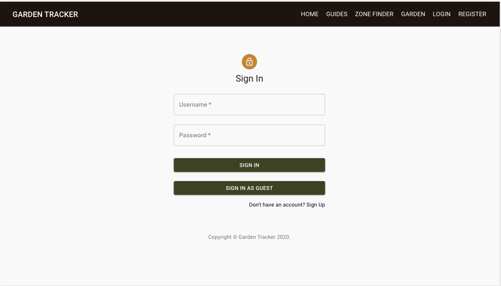
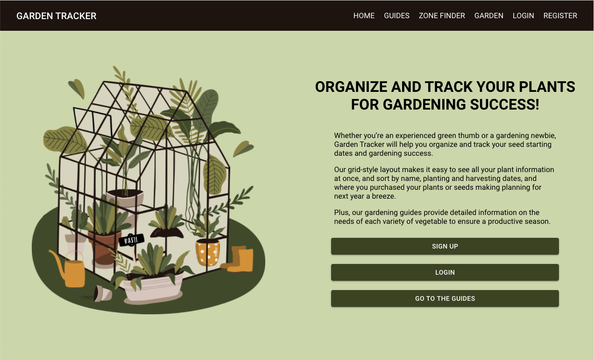
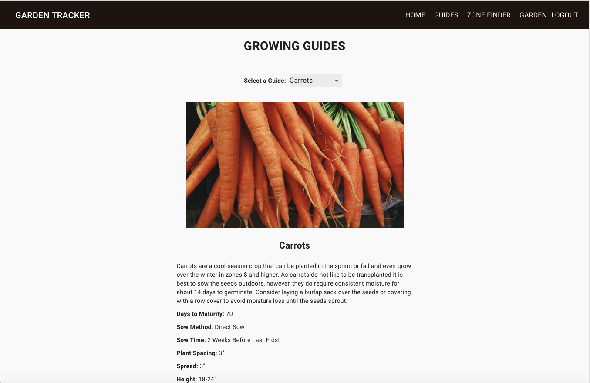
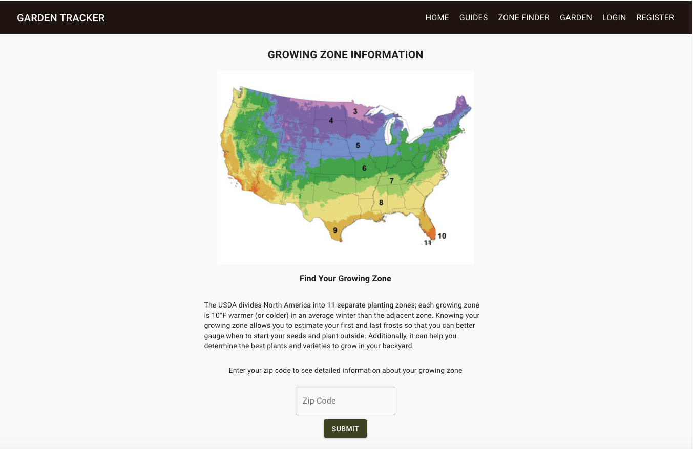
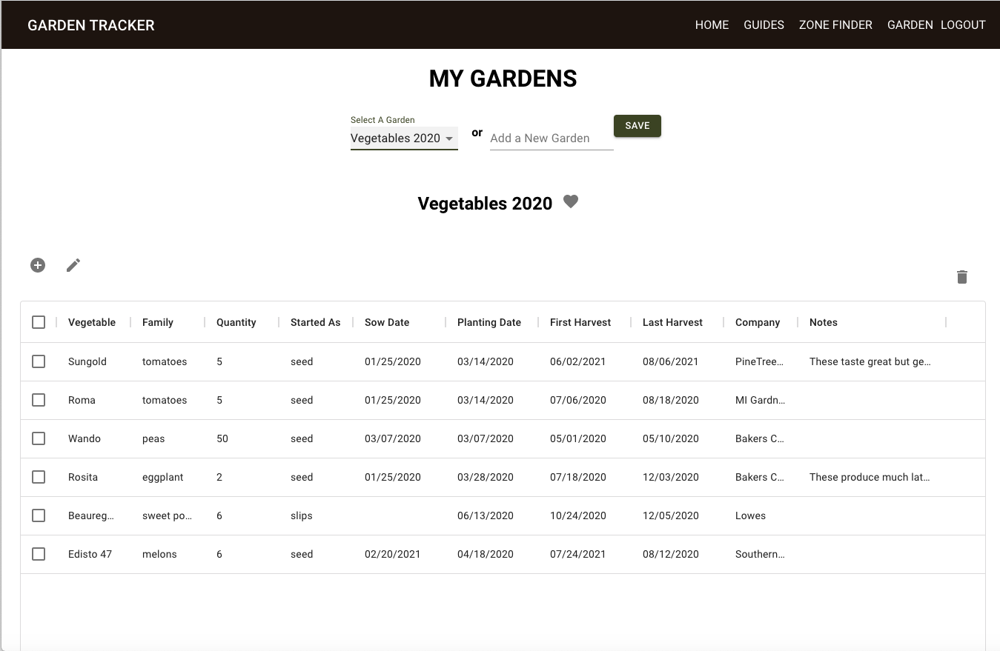
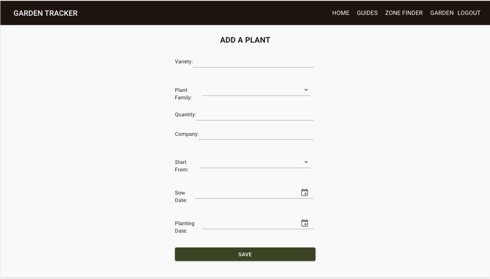
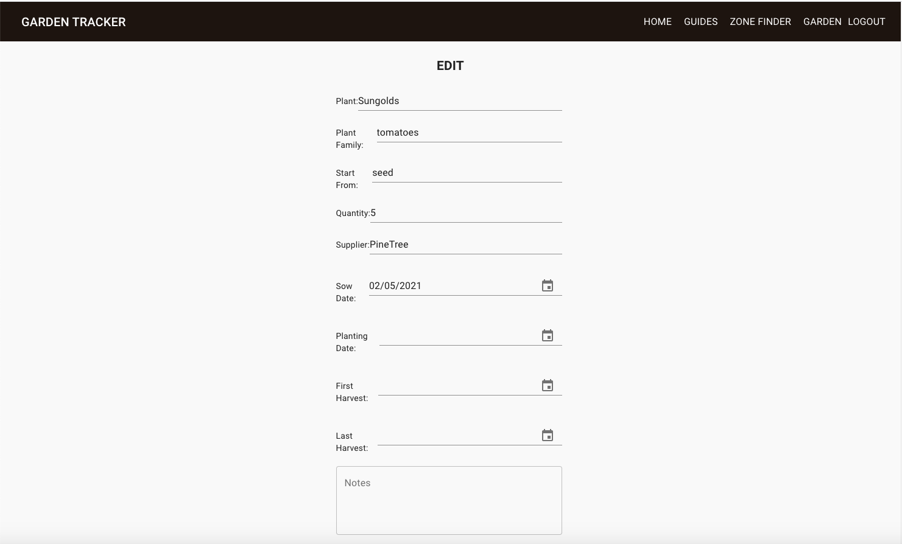

 

    

# 
<b>Garden Tracker | Full Stack Web App</b>

View the live version of Garden Tracker: http://garden-tracker-dc.surge.sh/

<!-- TABLE OF CONTENTS -->
## Table of Contents

* [About the Project](#about-the-project)
  * [Built With](#built-with)
* [Videos And Screenshots](#videos-and-screenshots)
* [Getting Started](#getting-started)
  * [Installation](#installation)
* [Team Members](#team-members)
* [Acknowledgements](#acknowledgements)

<!-- ABOUT THE PROJECT -->
## About The Project
Garden Tracker was designed to assist gardeners in planning and organizing their gardens tasks, including tracking seed starting, planting, and harvest dates, as well as where the plants or seeds came from to make planning and purchasing for future years a breeze. 

The app also includes growing guides about specific plants, and frost dates by zone - which can be identified by zip code - so that gardeners have all the information they need in one app.

Users can create multiple gardens, designate their primary garden, as well as add, edit, and delete plant information.

### Built With
Garden Tracker was built and deployed as a mobile-reponsive, full-stack web app. The frontend of the project was built using React, written in JavaScript. The backend of the project was created with Node and Express and a PostgreSQL database to store user information and gardening guides. 

The Phzmapi API was implimented to allow users to find their gardening zones by zip code. Login information is encryted using Bcryptjs and routes on both the front and back ends require JWT authorization.

The frontend was deployed on surge and the backend was deployed on Heroku. 

Full List of Tools & Technologies:

* React
* Redux
* JavaScript
* Node
* Express
* Pg-Promise
* PostgresSQL
* ElephantSQL
* RESTful API
* HTML
* CSS
* Material-UI
* bcryptjs
* JSON Web Tokens
* dotenv
* Heroku
* Surge 

## Videos and Screenshots

### Log In Page:

### Home:

### Guides:

### Zone Finder:

### Gardens:

### Add a Plant:

### Edit a Plant:

<!-- GETTING STARTED -->
## Creating Your Own Garden Tracker
### Getting Started
You can use Garden Tracker to create or modify your own gardening app, just fork the GitHub repository or clone it using the instructions below.

### Installation

Clone to local machine

git clone https://github.com/kjdonoghue/garden-tracker

<!-- CONTACT -->
## Created & Built By:
Kathryn Donoghue - https://github.com/kjdonoghue

Project Link: [https://github.com/kjdonoghue/garden-tracker](https://github.com/kjdonoghue/garden-tracker)

<!-- ACKNOWLEDGEMENTS -->
## Acknowledgements
  - Nathan Orris - **The Certified** - **DiR at DigitalCrafts Houston** -
    [NathanNoSudo](https://github.com/NathanNoSudo)
